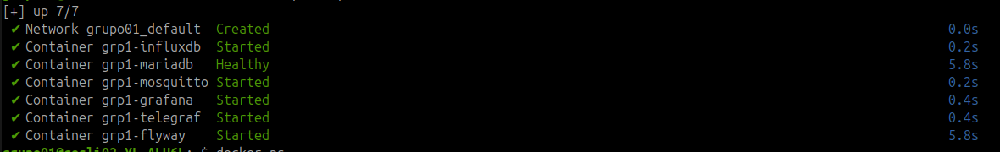

# Projeto Backend do módulo IHM

O projeto backend será responsável pela interligação da parte visual (frontend¹), banco de dados e interconexão com sistemas externos através de API REST (HTTP/HTTPS) ou mensageria via Pub/Sub (MQTT).

# Funcionalidades disponíveis

* Banco de dados: MariaDB
  * Flyway: serviço de versionamento do banco de dados
* Pub/Sub: Mosquitto

# Utilização

O sistema de backend monta suas integrações externas através do Docker Compose.
* para inicializar toda infraestrutura: `docker compose up -d`
* para desligar toda infraestrutura: `docker compose down`

Exemplo dos sistemas criados:

---

_1 frontend representa as telas que os operadores terão na linha de montagem_