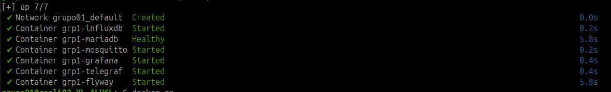
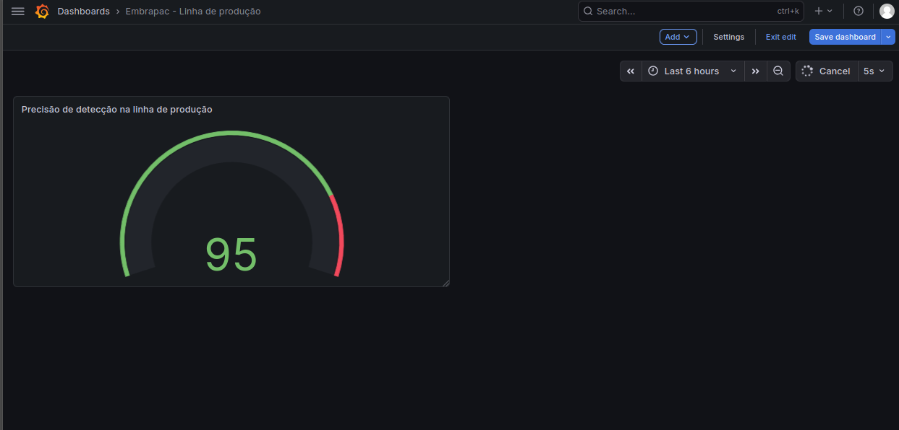

# Projeto Backend

O projeto backend será responsável pela interligação do módulo IHM (formado por um frontend¹ e backend) ao banco de dados e interconexão com sistemas externos através de API REST (HTTP/HTTPS) ou mensageria via Pub/Sub (MQTT).

Além do mais será responsável por orquestrar a infraestrutura de monitoramento dos KPIs do sistema, gerados pelo módulo Microcontrolador e pelo módulo EDGE, utilizando ferramentas como InfluxDB, Telegraf e Grafana.

# Funcionalidades disponíveis

* Banco de dados: MariaDB
  * Flyway: serviço de versionamento do banco de dados
* Pub/Sub: Mosquitto
* Ingestao MQTT para banco: serviço Node.js mqtt-ingestor
* Monitoramento: InfluxDB, Telegraf e Grafana

# Utilização

## Pré-requisitos
- Docker e Docker Compose instalados

O sistema de backend monta suas integrações externas através do Docker Compose.
* para inicializar toda infraestrutura: `docker compose up -d`
* para desligar toda infraestrutura: `docker compose down`

### Servico Node.js de ingestao MQTT -> MariaDB

O servico `backend-server` roda no Docker Compose e:
- escuta tópicos MQTT com dados provenientes do EDGE ou IHM
- valida campos obrigatorios do JSON
- persiste nas tabelas de entidade de negócio
- persiste na tabela `mqtt_ingest_log` como forma de rastreabilidade

Comandos uteis:

```bash
docker compose up -d --build backend-server
docker compose logs -f backend-server
```

Exemplo dos sistemas criados:




# Monitoramento

Estrutura no Docker Compose para rodar o **Mosquitto**, **InfluxDB**, **Telegraf** e **Grafana**, para monitoramento dos KPIs do sistema.


## Estrutura de arquivos
```
.
├── docker-compose.yml
├── mosquitto/
│   ├── config/
│   │   └── mosquitto.conf        ← Obrigatório existir antes do `up`
│   ├── data/                     ← Gerado pelo broker
│   └── log/                      ← Logs do mosquitto
├── telegraf/
│   └── telegraf.conf             ← Configuração do pipeline MQTT→InfluxDB
└── grafana/
    ├── provisioning/
    │   ├── datasources/
    │   │   └── influxdb.yaml     ← Datasource InfluxDB pré-configurado
    │   └── dashboards/
    │       └── embrapac.yaml     ← Apontamento para a pasta de dashboards
    └── dashboards/
        └── embrapac-kpis.json    ← Dashboard com os KPIs da aplicação
```

## Teste via MQTT num tópico de exemplo

Teste inicial do ambiente realizado no mesmo Raspberry Pi 5: publicação de dados no mosquitto para exibição no _dashboard_ do Grafana:



### Amostra positiva (class_match=true + mcu_ts_in_range=true)
```bash
mosquitto_pub -h localhost -t "sensores/mcu" \
  -m '{"mcu_class":"Media","mcu_timestamp":"2026-03-30 10:00:00","class_match":true,"mcu_ts_in_range":true}'
```

### Amostra negativa
```bash
mosquitto_pub -h localhost -t "sensores/mcu" \
  -m '{"mcu_class":"Media","mcu_timestamp":"2026-03-30 10:00:01","class_match":true,"mcu_ts_in_range":false}'
```

---

## Payload esperado
```json
{
  "mcu_class": "Media",
  "mcu_timestamp": "2026-03-30 10:26:42.799000",
  "class_match": true,
  "mcu_ts_in_range": false
}
```

Esse payload agora tambem e persistido em MariaDB (tabela `mqtt_ingest_log`) para rastreabilidade e consumo futuro pela API.

**Regra:** `positive_sample = 1` somente quando **ambos** `class_match` e `mcu_ts_in_range` forem `true`.

O Gauge exibe: `mean(positive_sample) * 100` = percentual de amostras positivas.

## Acesso ao Grafana

Do servidor de backend disponibilizado

- URL: http://10.7.202.10:13000
- Usuário: `admin`
- Senha: verificar nos 

O banco de dados InfluxDB e o _dashboard_ **Embrapac KPIs** já estarão pré-carregados automaticamente.

---

_1 frontend representa as telas que os operadores terão na linha de montagem_